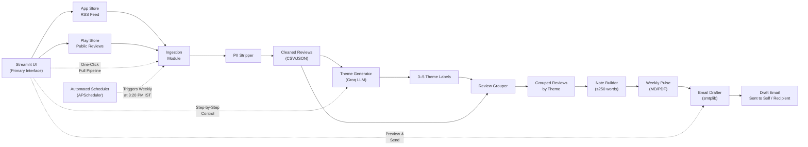

# INDmoney Weekly Review Pulse — Phase-Wise Architecture

> Turn recent App Store / Play Store reviews into a one-page weekly pulse with top themes, real user quotes, and action ideas — then draft an email with the note.

---

## Tech Stack

| Layer | Choice | Rationale |
|---|---|---|
| Language | Python 3.11+ | Rich ecosystem for NLP, data processing |
| LLM | **Groq** (via `groq` SDK) | Fast inference, free tier available |
| Model | `llama-3.3-70b-versatile` | Best quality on Groq for structured tasks |
| Review Source | Public CSV/JSON export (Apple RSS feed + Google Play scraper) | No login required — compliant with constraints |
| Web UI | **Streamlit** | Rapid prototyping, built-in PDF export |
| Email | `smtplib` + Gmail App Password | Simple, no third-party dependency |
| Data | Pandas + JSON/CSV flat files | Lightweight, no DB needed |

---

## Project Structure

```
appreview_insight_analyzer/
├── .env.example              # Template for secrets
├── .gitignore
├── README.md
├── requirements.txt
├── config.py                 # Centralized config & env loading
│
├── data/
│   ├── raw/                  # Raw review exports (CSV/JSON)
│   └── processed/            # Cleaned, PII-stripped reviews
│
├── src/
│   ├── __init__.py
│   ├── ingestion/
│   │   ├── __init__.py
│   │   ├── apple_reviews.py      # Apple App Store RSS feed fetcher
│   │   ├── google_reviews.py     # Google Play public review fetcher
│   │   └── pii_stripper.py       # PII removal utility
│   │
│   ├── analysis/
│   │   ├── __init__.py
│   │   ├── theme_generator.py    # Groq LLM → generate themes
│   │   └── review_grouper.py     # Assign reviews → themes
│   │
│   ├── report/
│   │   ├── __init__.py
│   │   ├── note_builder.py       # Gemini LLM → build weekly note
│   │   └── email_drafter.py      # Compose & send draft email
│   │
│   └── orchestrator.py           # End-to-end pipeline runner
│
├── outputs/
│   ├── weekly_notes/             # Generated Markdown / PDF notes
│   └── email_drafts/             # Email text/screenshot artifacts
│
├── app.py                        # Streamlit web UI
├── scheduler.py                  # Automated job runner (APScheduler)
└── tests/
    ├── test_pii_stripper.py
    ├── test_theme_generator.py
    └── test_note_builder.py
```

---

## Data Flow



---

## LLM Strategy

### Phase-Based LLM Selection

**Phase 1 & 2: Groq LLM**
- **Theme Generation**: Groq's `llama-3.3-70b-versatile` for identifying 3-5 themes
- **Review Classification**: Groq for assigning reviews to themes
- **Why Groq**: Fast, cost-effective for bulk processing tasks
- **Limitations**: Token limits for large datasets (managed with chunking)

**Phase 3: Gemini LLM**
- **Quote Selection**: Gemini for picking most impactful user quotes
- **Action Ideas**: Gemini for generating actionable improvement suggestions
- **Why Gemini**: Higher quality for nuanced text analysis and creative tasks
- **Benefits**: Better understanding of context and sentiment

### API Management Strategy

**Groq (Phases 1-2)**
- Chunked processing for large datasets (150 reviews per chunk)
- Rate limiting with 1-second delays between calls
- Fallback themes for API failures

**Gemini (Phase 3)**
- Batch processing for quote selection (10 reviews per batch)
- Stratified sampling for action ideas (5 reviews per theme)
- Two-stage selection for best quotes
- 0.5-second delays between API calls

### Cost & Performance Optimization

| Phase | LLM | API Calls (Typical) | Cost Strategy |
|-------|-----|-------------------|---------------|
| Phase 1 | Groq | 1-3 calls | Chunked for large datasets |
| Phase 2 | Groq | 20-25 calls | Batch processing (25 reviews/batch) |
| Phase 3 | Gemini | 4-7 calls | Smart batching + sampling |

---

## Phase 1 — Review Ingestion

**Goal:** Fetch 8–12 weeks of public INDmoney reviews from both stores and produce a clean, PII-free dataset.

### Components

#### [NEW] [apple_reviews.py](file:///C:/Users/Apurva/New%20folder%20(2)/appreview_insight_analyzer/src/ingestion/apple_reviews.py)

- Uses Apple's public RSS/JSON feed: `https://itunes.apple.com/in/rss/customerreviews/id=<APP_ID>/sortby=mostrecent/json`
- Paginate to collect reviews from the last 8–12 weeks
- Extract fields: `rating`, `title`, `text`, `date`
- Returns a list of dicts / Pandas DataFrame

#### [NEW] [google_reviews.py](file:///C:/Users/Apurva/New%20folder%20(2)/appreview_insight_analyzer/src/ingestion/google_reviews.py)

- Uses `google-play-scraper` Python package (public API, no login)
- Fetch reviews sorted by newest, filter to last 8–12 weeks
- Extract fields: `rating`, `title`, `text`, `date`
- Returns a list of dicts / Pandas DataFrame

#### [NEW] [pii_stripper.py](file:///C:/Users/Apurva/New%20folder%20(2)/appreview_insight_analyzer/src/ingestion/pii_stripper.py)

- Regex-based removal of:
  - Email addresses (`\b[A-Za-z0-9._%+-]+@[A-Za-z0-9.-]+\.[A-Z|a-z]{2,}\b`)
  - Phone numbers (Indian + international patterns)
  - Aadhaar-like 12-digit numbers
  - PAN card patterns (`[A-Z]{5}[0-9]{4}[A-Z]`)
  - Usernames / author fields (strip entirely — never store)
- Replace matched PII with `[REDACTED]`
- Output: cleaned CSV + JSON in `data/processed/`

### Phase 1 Output
```json
{
  "source": "apple|google",
  "rating": 4,
  "title": "Great app but...",
  "text": "Love the mutual fund tracking but [REDACTED] is slow",
  "date": "2026-03-15",
  "week_label": "W12-2026"
}
```

---

## Phase 2 — Theme Generation (Groq LLM)

**Goal:** Use Groq to identify 3–5 recurring themes from the cleaned reviews.

### Components

#### [NEW] [theme_generator.py](file:///C:/Users/Apurva/New%20folder%20(2)/appreview_insight_analyzer/src/analysis/theme_generator.py)

**Strategy: Two-pass LLM approach**

**Pass 1 — Theme Discovery:**
- Sample up to ~100 representative reviews (stratified by rating)
- Send to Groq with a structured prompt:

```
You are a product analyst. Given these app reviews for INDmoney,
identify exactly 3 to 5 recurring themes. Each theme should be:
- A short label (2-4 words)
- A one-line description

Return ONLY valid JSON:
{"themes": [{"label": "...", "description": "..."}]}
```

- Model: `llama-3.3-70b-versatile`
- Temperature: `0.3` (deterministic but creative enough)
- Parse JSON response → list of theme objects

**Pass 2 — Review-to-Theme Assignment:**

#### [NEW] [review_grouper.py](file:///C:/Users/Apurva/New%20folder%20(2)/appreview_insight_analyzer/src/analysis/review_grouper.py)

- Batch reviews (20–30 per call) and ask Groq to assign each to one of the discovered themes:

```
Given these themes: [{themes}]
Classify each review below into exactly one theme.
Return JSON: [{"review_index": 0, "theme": "Theme Label"}]

Reviews:
{batch}
```

- Accumulate results → DataFrame with `theme` column
- Handle edge cases: reviews that don't fit any theme → labeled `"Other"`
- Cap total themes at 5 (merge smallest if needed)

### Phase 2 Output
```
reviews_grouped.csv
┌────────┬───────┬──────────────────────┬──────────────────────────┬──────────┬──────────────┐
│ source │ rating│ title                │ text                     │ date     │ theme        │
├────────┼───────┼──────────────────────┼──────────────────────────┼──────────┼──────────────┤
│ google │ 2     │ App crashes daily    │ Keeps crashing when...   │ 2026-03-10│ App Stability│
│ apple  │ 5     │ Best for MF tracking │ Love the SIP tracker...  │ 2026-03-12│ MF Features  │
└────────┴───────┴──────────────────────┴──────────────────────────┴──────────┴──────────────┘
```

---

## Phase 3 — Weekly Note Generation

**Goal:** Produce a ≤250-word, scannable one-page weekly pulse.

### Components

#### [NEW] [note_builder.py](file:///C:/Users/Apurva/New%20folder%20(2)/appreview_insight_analyzer/src/report/note_builder.py)

**Input:** Grouped reviews for the most recent week.

**Step 1 — Select Top 3 Themes:**
- Rank themes by review count for the target week
- Pick top 3

**Step 2 — Pick Best Quote per Theme:**
- For each top theme, send its reviews to **Gemini**:

```
From these reviews under the theme "{theme}", select the SINGLE most impactful quote.
Criteria: specific, actionable, no PII, under 100 words.
Return only the quote text.
```

**Step 3 — Generate 3 Action Ideas:**
- Send top-3 themes + their review summaries to **Gemini**:

```
You are a product strategist for INDmoney.
Given these top user feedback themes and sample reviews,
suggest exactly 3 concrete, actionable improvement ideas.
Each idea: 1 sentence, specific, implementable.
Return JSON: {"actions": ["...", "...", "..."]}
```

**Step 4 — Assemble Note:**
- Render Markdown template:

```markdown
# 📊 INDmoney Weekly Review Pulse
**Week:** W12-2026 (Mar 17 – Mar 23)
**Reviews Analyzed:** 142 (Apple: 58, Google: 84)

---

## 🔥 Top Themes
1. **App Stability** — 34% of reviews mention crashes/freezes
2. **MF Tracking** — 22% praise SIP & mutual fund features
3. **Customer Support** — 18% report slow response times

## 💬 User Voices
> "App crashes every time I try to check my portfolio value" — ★★☆☆☆
> "Best SIP tracker I've found, auto-detects all my funds" — ★★★★★
> "Raised a ticket 5 days ago, still no reply" — ★☆☆☆☆

## 💡 Action Ideas
1. Prioritize crash-fix sprint for portfolio view (Android 12+)
2. Highlight MF tracking in onboarding — it's a top delight driver
3. Set SLA of 48hr first-response for support tickets

---
*Generated from 142 public reviews · No PII included*
```

- Word-count validation: trim if > 250 words
- Save as `.md` in `outputs/weekly_notes/`
- Optional: convert to PDF via `markdown2` + `weasyprint`

---

## Phase 4 — Email Drafting

**Goal:** Compose and send a draft email containing the weekly pulse to any recipient (not just self).

### Components

#### [NEW] [email_drafter.py](file:///C:/Users/Apurva/New%20folder%20(2)/appreview_insight_analyzer/src/report/email_drafter.py)

**Email Composition:**
- Subject: `[INDmoney Pulse] Week W12-2026 — Top: App Stability, MF Tracking, Support`
- Body: Personalized email with weekly note content
- From: User's configured email
- To: Any specified recipient (supports custom receivers)

**Email Structure:**
```
Subject: [INDmoney Pulse] Week W12-2026 — Top: App Performance, Customer Support, UI/UX Issues
To: john.doe@company.com
From: sender@gmail.com
Date: Wed, 25 Mar 2026 12:00:00 +0000
Content-Type: multipart/alternative; boundary="===============1234567890=="

--===============1234567890==
Content-Type: text/html; charset="utf-8"

<!DOCTYPE html>
<html>
<head>
    <meta charset="UTF-8">
    <title>INDmoney Weekly Review Pulse</title>
    <style>
        body { font-family: Arial, sans-serif; line-height: 1.6; color: #333; max-width: 600px; margin: 0 auto; padding: 20px; }
        h1 { color: #2c3e50; border-bottom: 2px solid #3498db; padding-bottom: 10px; }
        .greeting { color: #2c3e50; font-size: 1.1em; margin-bottom: 20px; }
        .footer { font-size: 0.9em; color: #7f8c8d; margin-top: 30px; }
    </style>
</head>
<body>
    <p class="greeting">Hi John,</p>
    
    <p>Here's your weekly INDmoney app review pulse for W12-2026.</p>
    
    <h1>INDmoney Weekly Review Pulse</h1>
    <p><strong>Week:</strong> W12-2026 (Mar 23 - Mar 29)<br>
    <strong>Reviews Analyzed:</strong> 7 (Apple: 3, Google: 4)</p>
    
    <h2>Top Themes</h2>
    <ol>
    <li><strong>App Performance</strong> - 28.6% of reviews</li>
    <li><strong>Customer Support</strong> - 14.3% of reviews</li>
    <li><strong>UI/UX Issues</strong> - 14.3% of reviews</li>
    </ol>
    
    <h2>User Voices</h2>
    <blockquote>
    <p>"App keeps crashing every time I try to check my portfolio value." - ★★★☆☆</p>
    </blockquote>
    
    <h2>Action Ideas</h2>
    <ol>
    <li>Implement crash reporting with real-time monitoring</li>
    <li>Create dedicated premium support line for high-value customers</li>
    <li>Enhance MF discovery algorithm with personalized recommendations</li>
    </ol>
    
    <hr>
    
    <p><strong>Quick Summary:</strong></p>
    <ul>
    <li>Week: W12-2026</li>
    <li>Total Reviews: 7</li>
    <li>Top Themes: 3 themes analyzed</li>
    </ul>
    
    <p><strong>Methodology:</strong><br>
    This weekly pulse is automatically generated from public app reviews using AI analysis.</p>
    
    <p>For questions or feedback, please contact the product team.</p>
    
    <p>Best regards,<br>
    INDmoney Product Insights Team</p>
    
    <div class="footer">
    <p>This email was generated automatically from public app reviews.</p>
    <p>Generated on: 2026-03-25 12:00:00</p>
    </div>
</body>
</html>

--===============1234567890==
Content-Type: text/plain; charset="utf-8"

Hi John,

Here's your weekly INDmoney app review pulse for W12-2026.

# INDmoney Weekly Review Pulse
**Week:** W12-2026 (Mar 23 - Mar 29)
**Reviews Analyzed:** 7 (Apple: 3, Google: 4)

---

## Top Themes
1. **App Performance** - 28.6% of reviews
2. **Customer Support** - 14.3% of reviews
3. **UI/UX Issues** - 14.3% of reviews

## User Voices
> "App keeps crashing every time I try to check my portfolio value." - ★★★☆☆

## Action Ideas
1. Implement crash reporting with real-time monitoring
2. Create dedicated premium support line for high-value customers
3. Enhance MF discovery algorithm with personalized recommendations

---

**Quick Summary:**
- Week: W12-2026
- Total Reviews: 7
- Top Themes: 3 themes analyzed

**Methodology:**
This weekly pulse is automatically generated from public app reviews using AI analysis.

For questions or feedback, please contact the product team.

Best regards,
INDmoney Product Insights Team

---
*Generated from 7 public reviews · No PII included*

--===============1234567890==--
```

**Personalization Features:**
- **First Name Extraction**: Automatically extracts first name from email (john.doe@company.com → "Hi John,")
- **Smart Fallbacks**: Uses "Team" for generic emails (info@company.com → "Hi Team,")
- **Multiple Formats**: Supports john.doe, john_doe, john-doe formats
- **Professional Tone**: Maintains professional yet personalized communication

**Sending Method:**
- `smtplib.SMTP_SSL` → Gmail SMTP (`smtp.gmail.com:465`)
- Credentials via `.env`: `EMAIL_ADDRESS`, `EMAIL_APP_PASSWORD`
- Support for custom receivers (not just self-email)
- Alternatively: save as `.eml` file for manual sending

**Email Artifacts:**
- Save the composed email as text artifact in `outputs/email_drafts/`
- Support for multiple recipients and teams

---

## Phase 5 — Orchestration & UI (Primary Interface)

**Goal:** The Streamlit dashboard is the **primary interface** for the entire pipeline. Users trigger all phases — from fetching reviews to sending the email — directly from the UI, with no CLI needed.

### Components

#### [NEW] [app.py](file:///C:/Users/Apurva/New%20folder%20(2)/appreview_insight_analyzer/app.py)

**Streamlit Dashboard — 5 tabs (UI-driven workflow):**

| Tab | User Action | What Happens |
|---|---|---|
| 🚀 **Run Pipeline** | Click **"Run Full Pipeline"** | Executes all 4 phases in sequence, shows progress, saves all outputs |
| 📥 Reviews | Click **"Fetch Reviews"** or upload CSV | Ingests reviews, strips PII, shows filterable table |
| 🏷️ Themes | Click **"Generate Themes"** | Calls Groq to discover themes, classify reviews, shows distribution chart |
| 📝 Weekly Note | Click **"Build Weekly Note"** | Generates ≤250-word pulse, renders inline, offers MD download |
| ✉️ Email | Click **"Send Email"** or **"Save Draft"** | Previews the email, sends via Gmail SMTP or saves draft locally |

**One-Click Full Pipeline (Tab 1 — "Run Pipeline"):**
- Single button: **"🚀 Generate Weekly Pulse & Send Email"**
- Runs Phase 1 → 2 → 3 → 4 sequentially with a real-time progress bar
- On completion: displays the weekly note inline + confirmation of email sent/draft saved
- No CLI interaction required at any step

**Step-by-Step Control (Tabs 2–5):**
- Each tab is self-contained and lets users run one phase at a time
- Output from each tab is preserved in session state for the next tab
- Users can re-run individual phases without repeating earlier steps

#### [NEW] [orchestrator.py](file:///C:/Users/Apurva/New%20folder%20(2)/appreview_insight_analyzer/src/orchestrator.py)

Backend pipeline used by the UI's "Run Full Pipeline" button:

```python
def run_weekly_pulse(target_week=None):
    # Phase 1: Ingest
    reviews = ingest_reviews(weeks_back=12)
    clean_reviews = strip_pii(reviews)
    save_to_csv(clean_reviews, "data/processed/")

    # Phase 2: Themes
    themes = generate_themes(clean_reviews)
    grouped = assign_themes(clean_reviews, themes)

    # Phase 3: Note
    note = build_weekly_note(grouped, target_week)
    save_note(note, "outputs/weekly_notes/")

    # Phase 4: Email
    send_draft_email(note)
```

> **Note:** The orchestrator can also be called from CLI as a fallback:
> `python -c "from src.orchestrator import run_weekly_pulse; run_weekly_pulse()"`

---

## Phase 6 — Automated Scheduling

**Goal:** Run the weekly pulse completely hands-free on a recurring schedule and deliver it to a fixed recipient (`sugandhawankar123@gmail.com`).

### Components

#### [NEW] [scheduler.py](file:///C:/Users/Apurva/New%20folder%20(2)/appreview_insight_analyzer/scheduler.py)

**Automated Job Runner:**
- Uses `apscheduler` (Advanced Python Scheduler) with `pytz` for timezone awareness (Asia/Kolkata).
- **Trigger:** Configured as a `CronTrigger`.
- **Target Time:** Runs every day at **3:20 PM IST** (designed to be customizable to specific days, e.g., Mondays).
- **Execution:** Spawns a subprocess that runs the established CLI command: `python cli.py run`.
- **Logging:** Maintains a local `scheduler.log` to record successes, failures, and execution outputs without needing to watch the terminal.
- **Recipient:** Sends the final email unconditionally to the configured target address.

---

## Configuration & Environment

#### [NEW] [config.py](file:///C:/Users/Apurva/New%20folder%20(2)/appreview_insight_analyzer/config.py)

```python
import os
from dotenv import load_dotenv

load_dotenv()

GROQ_API_KEY = os.getenv("GROQ_API_KEY")
GROQ_MODEL = "llama-3.3-70b-versatile"

APPLE_APP_ID = "1473756500"       # INDmoney App Store ID
GOOGLE_PACKAGE = "com.indwealth"  # INDmoney Play Store package

EMAIL_ADDRESS = os.getenv("EMAIL_ADDRESS")
EMAIL_APP_PASSWORD = os.getenv("EMAIL_APP_PASSWORD")
SMTP_SERVER = "smtp.gmail.com"
SMTP_PORT = 465

MAX_THEMES = 5
NOTE_MAX_WORDS = 250
WEEKS_BACK = 12
```

#### [NEW] `.env.example`
```
GROQ_API_KEY=your_groq_api_key_here
EMAIL_ADDRESS=your_email@gmail.com
EMAIL_APP_PASSWORD=your_app_password_here
```

---

## PII Protection Strategy

| Layer | Method |
|---|---|
| Ingestion | Never store `author`/`userName` fields |
| PII Stripper | Regex for email, phone, Aadhaar, PAN → `[REDACTED]` |
| LLM Prompts | Instruct Groq: "Do not include any usernames, emails, or IDs" |
| Output | Final note contains only anonymized quotes with star ratings |

---

## Dependencies

```
# requirements.txt
groq>=0.12.0
google-play-scraper>=1.2.7
pandas>=2.1.0
python-dotenv>=1.0.0
streamlit>=1.38.0
markdown2>=2.5.0
weasyprint>=62.0        # Optional: PDF generation
```

---

## Verification Plan

### Automated Tests
- **PII Stripper:** `pytest tests/test_pii_stripper.py` — test email, phone, Aadhaar, PAN detection and redaction
- **Theme Generator:** `pytest tests/test_theme_generator.py` — mock Groq response, verify JSON parsing and ≤5 themes
- **Note Builder:** `pytest tests/test_note_builder.py` — verify word count ≤250, correct sections present

### Manual / Browser Verification
1. Run `streamlit run app.py` → verify all 4 tabs render correctly
2. Check the generated weekly note in `outputs/weekly_notes/` — confirm ≤250 words, 3 themes, 3 quotes, 3 actions
3. Verify email draft in `outputs/email_drafts/` — confirm no PII present
4. Verify `data/processed/` CSV — confirm no usernames, emails, or IDs

---

## Deliverables Mapping

| Deliverable | Location |
|---|---|
| Working prototype | `streamlit run app.py` |
| Latest weekly note (MD) | `outputs/weekly_notes/week_W12-2026.md` |
| Email draft | `outputs/email_drafts/` + screenshot |
| Reviews CSV/JSON | `data/processed/reviews_cleaned.csv` |
| README | `README.md` (re-run instructions + theme legend) |

---

## How to Re-run for a New Week

### Via UI (Recommended)

1. Launch the dashboard: `streamlit run app.py`
2. Enter your Groq API key and email settings in the **sidebar**
3. Go to the **🚀 Run Pipeline** tab
4. Click **"Generate Weekly Pulse & Send Email"**
5. The note and email are generated and sent automatically

### First-Time Setup

```bash
# 1. Activate virtual environment
python -m venv venv && venv\Scripts\activate

# 2. Install dependencies
pip install -r requirements.txt

# 3. Set your environment variables (optional — can also enter in UI sidebar)
copy .env.example .env   # Then edit with your keys

# 4. Launch the Streamlit UI
streamlit run app.py
```

### Via CLI (Fallback)

```bash
python -c "from src.orchestrator import run_weekly_pulse; run_weekly_pulse()"
```
